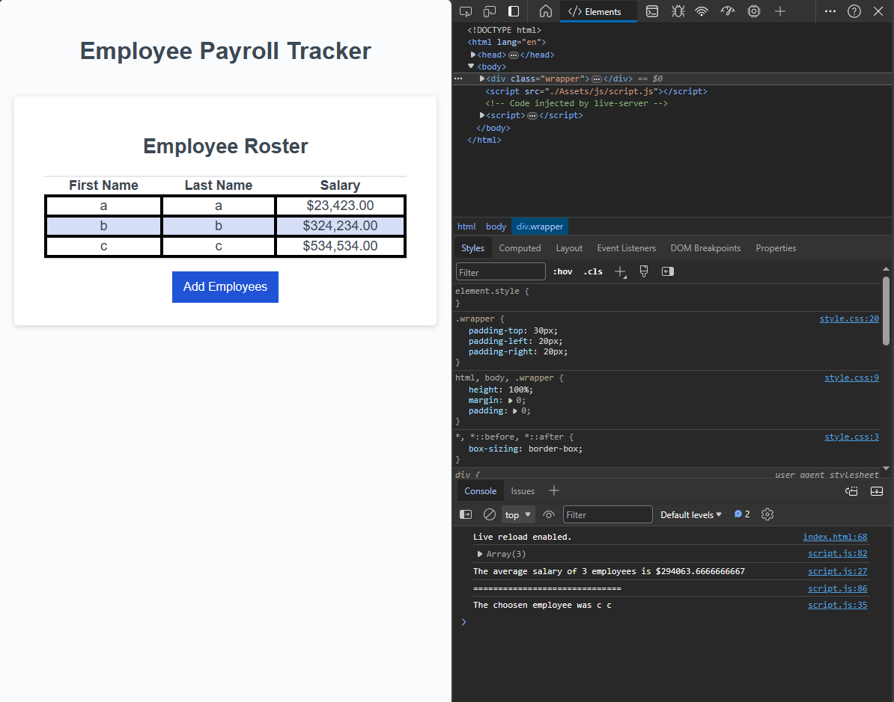

# employee-payroll-tracker

## Description

Enables a payroll manager to view and manage employee payroll data. 

- My motivation is to learn more about JavaScript.
- I built this project to improve my code writing skill. 
- By applying proper syntax to the JavaScript file, the JavaScript programs are constructed. 
- I learned ways to structure JavaScript. 

## Usage

https://pandord24.github.io/portfolio/

By clicking the link provided, you can access the project hosted by github.

## Credits

Gordon Kwan
https://github.com/pandord24

